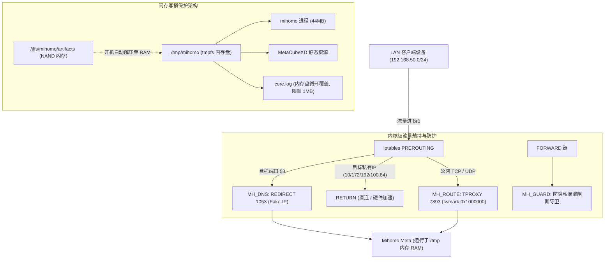

# ASUSWRT-Merlin Mihomo Transparent Proxy (RT-AX86U)

[](https://opensource.org/licenses/MIT)
[](https://github.com/WASIDJ/rsi)

专为**华硕梅林（ASUSWRT-Merlin / KoolShare）及 ARM64 软硬路由**打造的高性能、企业级透明代理与网络旁路部署方案。基于 **Mihomo (Clash Meta) v1.19+** 与 **MetaCubeXD Web UI**。

配合专用 CLI 管理工具 [**`rsi`**](https://github.com/WASIDJ/rsi)（支持 Homebrew 安装），实现零断流热重载、一键换机场、自建 Hysteria 2 / Vless 节点无缝注入与全自动保活。

---

## 核心架构与设计哲学



### 1. 国内流量硬件直连旁路与博通 Flow Cache 加速 (Hardware Offload & Chnroute)
- **双层直连加速**：
  - **DNS 域名层**：内置 `fake-ip-filter` 覆盖全量 `+.cn` 域名及国内主流服务（百度、阿里、腾讯、B站、字节、京东等），请求直发本地公共 DNS（223.5.5.5 / 119.29.29.29）获取真实公网 IP。
  - **L3/L4 硬件层**：iptables `MH_ROUTE` 与 `MH_GUARD` 匹配 `chnroute` ipset（4,290+ 国内网段，仅占 215KB 内存），发往国内的所有 TCP/UDP 流量第一时间 `-j RETURN`，完全不进用户态 TPROXY。
- **博通 BCM4908 硬件流缓存（Flow Cache / Runner）**：国内千兆流量直通硅片硬件线速转发引擎，国内测速与大文件下载轻松跑满 **1000M 宽带**，且路由器 CPU 占用几乎为 **0%**。

### 2. 内核协议栈 TCP BDP 窗口优化 (Throughput Scaling)
- 在 `firewall-start` 开机启动项中固化 TCP 接收/发送缓冲区至 **16MB** (`rmem_max`/`wmem_max = 16777216`) 并开启 TCP Fast Open 3。
- 彻底突破 Linux 默认 512KB 缓冲区对跨国高延迟（RTT 150ms+）单连接的吞吐锁死，实测单线程跨国下载速度从 **29 Mbps 飙升至 112+ Mbps（3.8倍加速）**。

### 3. 闪存寿命与空间极致优化 (Flash Wear Protection)
- **NAND 闪存保护**：路由器的 JFFS 分区极小且存在擦写寿命限制。本项目将二进制和 UI 压缩存储（`mihomo.gz`、`ui.tgz`、`country.mmdb.gz`），开机时仅用 ~1.3 秒解压至 `/tmp`（tmpfs 内存盘）运行。
- **无磁盘日志写入**：所有日志写入内存虚拟文件系统，并限制最大 1MB 自动截断，彻底避免闪存磨损与爆满。

### 4. 防静默直连泄漏守卫 (Leak Guard)
- 在 `FORWARD` 链配置 `MH_GUARD` 规则：当 Mihomo 服务停止或异常退出时，局域网公网境外 TCP/UDP 流量将被**安全阻断**，防止内网流量在代理失效时静默以裸连形式直连公网导致隐私泄漏。

### 5. 双重监控与自动保活 (Dual Watchdog)
- **进程守护**：`service.sh supervise` 以后台守护进程模式每 5 秒探测一次核心状态，异常退出毫秒级拉起。
- **Crontab 兜底**：系统 crontab 每分钟运行一次 `service.sh ensure`，防止守护进程自身被 OOM 终止。

### 6. 零断流秒级热重载 (Zero-Downtime Hot Reload)
- 支持通过 Mihomo 本地 REST API 进行配置文件热重载（`PUT /configs?force=true`），节点切换与订阅更新**不断网、不重置 TCP 连接**。

---

## 快速开始

### 准备工作
1. 路由器已刷入 **ASUSWRT-Merlin** 或 **KoolShare 梅林**（支持 RT-AX86U 等 ARM64 机型）。
2. 在路由器 Web 页面开启 SSH（`系统管理 -> 系统设置 -> 启用 SSH`）。
3. 本机已配置 SSH 免密登录至路由器（例如 `ssh RSI@192.168.50.1`）。

### 部署步骤

#### 方式一：使用本地 Python 管道一键部署（推荐）

```sh
# 1. 克隆本仓库
git clone https://github.com/WASIDJ/router-mihomo.git
cd router-mihomo

# 2. 初始化环境
python3 -m venv .venv
.venv/bin/pip install PyYAML==6.0.3

# 3. 配置连接参数
cp config.env.example config.env
# 修改 config.env 中的 TARGET="用户名@路由器IP" 与 AIRPORT_URL

# 4. 构建并推送到路由器
.venv/bin/python build.py
.venv/bin/python deploy.py

# 5. 校验透明代理与连通性
.venv/bin/python verify.py
.venv/bin/python verify_transparent.py
```

#### 方式二：在路由器内通过 `rsi` CLI 独立部署

在 Mac 上安装配套命令行工具：
```sh
# 安装 rsi CLI
brew install WASIDJ/rsi/rsi

# 一键推送 CLI 到路由器
rsi router deploy
```

---

## 日常运维：配合 `rsi` 极速管理

部署完成后，你**不再需要依赖 Mac 本地的 Python 环境**，直接在路由器上（或在 Mac 终端）使用 `rsi` CLI 即可完成全部日常运维：

### 1. 替换 / 更新机场订阅
```sh
# 换新机场：自动下载最新节点、融合自建节点、语法自检并秒级热重载
rsi sub set "https://your-airport.com/api/v1/client/subscribe?token=xxx"

# 日常节点刷新：
rsi sub update
```

### 2. 接入自建 Hysteria 2 (hy2) 节点
支持直接粘贴 `hysteria2://` 链接：
```sh
# 1. 添加自建 hy2 节点
rsi node add "hysteria2://pass@tokyo-hy2.example.com:443/?sni=tokyo-hy2.example.com&insecure=0#⚡ 自建-东京-HY2"

# 2. 查看所有自建节点
rsi node list

# 3. 删除指定自建节点
rsi node rm "⚡ 自建-东京-HY2"
```

> **自动分组与置顶**：
> 任何自建节点加入后，会在 Web 面板自动生成 `⚡ 自建节点` 分组，并自动置顶到所有规则分组（`♻️ 手动切换`、`🔎 Google`、`🧲 OpenAI` 等）的最前面，任你随意选择。机场更新时自建节点永久保留。

### 3. 查看状态与日志
```sh
# 查看核心 PID、内存占用 (VmRSS)、自建节点数量
rsi status

# 查看实时日志
rsi log -f

# 重新验证并热加载配置
rsi reload
```

---

## 端口与面板访问

- **Web 控制面板**：`http://192.168.50.1:9090/ui/`
- **RESTful API**：`http://192.168.50.1:9090`
- **混合 HTTP/SOCKS5 代理**：`192.168.50.1:7890`（需认证，账号密码见 `private/ACCESS.md`）
- **TPROXY 劫持端口**：`7893`
- **Fake-IP DNS 端口**：`1053`

---

## 应急回退与完全卸载

若在网络调试中需要完全撤除代理规则或卸载服务：

### 临时恢复直连上网（不代理）
```sh
/jffs/mihomo/service.sh stop
/jffs/mihomo/firewall.sh remove
```

### 完全卸载本部署
```sh
# 1. 停止服务并清理防火墙
/jffs/mihomo/service.sh stop
/jffs/mihomo/firewall.sh remove

# 2. 移除系统启动项钩子
rm -f /koolshare/init.d/*mihomo*.sh
rm -f /jffs/scripts/firewall-start
cru d MihomoWatchdog

# 3. 删除运行文件
rm -rf /jffs/mihomo /tmp/mihomo
```

---

## 仓库结构说明

```text
router-mihomo/
├── router/                  # 路由器原生脚本
│   ├── service.sh           # 服务启停、解压运行、保活与回退
│   ├── firewall.sh          # TPROXY、DNS 重定向与防泄漏守卫
│   ├── event.sh             # KoolShare 启动/网络重置事件响应
│   ├── clients.txt          # 代理内网客户端列表
│   └── config.template.yaml # 初始配置模板
├── manifest.json            # 官方二进制/UI 版本与 SHA256 校验锁定
├── config.env.example       # 用户环境变量模板 (目标IP/网段/机场URL)
├── custom_nodes.example.yaml# 自建节点 YAML/URI 示例
├── build.py                 # 本地构建与打包脚本
├── deploy.py                # 快速热部署 / 全量部署管道
├── verify.py                # 功能与连通性自检
├── verify_transparent.py    # 透明代理与 UDP STUN 穿透验证
└── install.sh               # 路由器独立安装引导脚本
```

---

## 开源协议

MIT License
